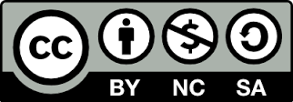
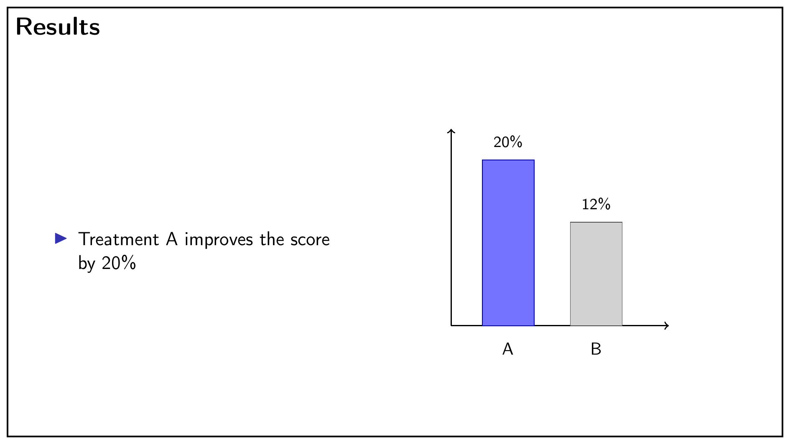

{width=3cm}

This work is released under the [Creative Commons Attribution 4.0 International](https://creativecommons.org/licenses/by/4.0/) license (CC BY 4.0). Reproduction, distribution, and adaptation of the material for any purpose, including commercial use, is permitted, provided that credit is given to the original author.

*Claude Code (Anthropic) was used as a support tool for language revision and English translation. The author takes full responsibility for the content.*

::: {.content-visible when-format="html"}
<a href="practical-guide-thesis-writing.pdf" download class="btn btn-primary" style="display:inline-flex;align-items:center;gap:0.4em;margin-bottom:1.5em;">
  <i class="bi bi-file-earmark-pdf"></i> Download PDF
</a>
:::

# Introduction

This guide is intended for students who are about to begin, or have already started, writing their thesis. The goal is not to provide absolute rules but practical suggestions that can make a real difference to the quality of the text. The advice here applies generally to any scientific text.

# Literature Search

## Knowing the Right Keywords

The first step in searching the scientific literature is knowing the correct keywords for your topic. These can be identified together with your supervisor at the beginning, and will grow richer and more numerous as your knowledge of the subject develops.

## Where to Search

The two main tools for bibliographic research are: **[Google Scholar](https://scholar.google.com)** and **[PubMed](https://pubmed.ncbi.nlm.nih.gov)**.

**[Google Scholar](https://scholar.google.com)** is the most convenient starting point: it indexes a large number of scientific articles, theses, and books. Be careful with **preprints** (for example those on [bioRxiv](https://www.biorxiv.org) or [PsyArXiv](https://psyarxiv.com)): these are works that have not yet undergone peer review and whose results may not be confirmed. My suggestion is not to avoid these sources entirely, but simply to bear in mind that they have not yet passed the peer-review process.

**[PubMed](https://pubmed.ncbi.nlm.nih.gov)** is the reference database for biomedical sciences. All results are peer-reviewed articles, making them more reliable in this respect, though coverage is narrower than Scholar.

## Start with Review Articles

When beginning to study a new topic, it is good practice to start with review articles.
Reviews can be of different types. The main types are _narrative reviews_ and _systematic reviews_.
The latter are more rigorous and less prone to bias, and for this reason are preferable when available.

Specific articles of interest can also be found through reviews, and should then be read in depth.

::: {.callout-note title="Note"}
The literature search will need to be repeated several times during the writing of the thesis, also based on new knowledge and evidence that emerges in the course of study, discussions, or from reading articles found during an initial search.
:::

## How to Evaluate an Article

Not all articles carry the same weight. Some useful criteria for assessing quality:

- **Peer review**: always prefer articles published in peer-reviewed journals.
- **Journal**: journals with a high impact factor are generally more selective, but this is not the only criterion. Reputation within the field also matters.
- **Predatory journals**: there are journals that publish any work for a fee, without genuine peer review. If a journal name is unfamiliar, it is worth verifying its reputation.

When in doubt, ask your supervisor.

## How to Read an Article

You do not necessarily need to read every article from start to finish: that would be far too time-consuming.

At the start of writing your thesis, or when you begin dealing with an unfamiliar topic, it is useful to read articles from start to finish, to start becoming familiar with the main elements (citations that tend to recur, issues that are always considered crucial, etc.). Gradually, you can skim the introduction more quickly (which will tend to be somewhat repetitive or predictable) and focus more on the methods, results, and discussion.

A good strategy is to start by carefully reading the title and abstract. If they are interesting, you can move on to the rest (introduction, methods, and results). Otherwise, it is sometimes better not to delve further into that specific article and to focus on other, more relevant articles.
In general, it is important to learn to manage strategically the time available for reading the literature, because reading every article in depth is almost always impossible.

::: {.callout-note title="Note"}
The strategy of reading articles, while it should be focused on the most "useful" ones, should not entirely and always exclude things that are not strictly necessary. The risk, in fact, is reading only articles that confirm your own hypotheses or that do not allow you to enrich your perspective.
:::

## Organising the Literature: Reference Management Software

Collecting articles in a folder of PDFs is not a strategy. It is far more efficient to use **reference management software**, which allows you to organise articles, add notes, and automatically generate the bibliography for your thesis.

The most recommended tool is **[Zotero](https://www.zotero.org)**: it is free, open source, and integrates with Word, LibreOffice, and LaTeX. It lets you save articles directly from the browser with a single click and insert citations into the text automatically.

Alternatives: [Mendeley](https://www.mendeley.com) (free but with more limitations).

## Using LLMs for Literature Search

LLMs (Large Language Models), such as [ChatGPT](https://chatgpt.com) or [Gemini](https://gemini.google.com), can be a useful aid for literature search. **My recommendation is to use them to discover articles but not to retrieve factual information** or citations.

LLMs are particularly useful for broadening your search scope or discovering new, relevant areas of literature — areas that might be highly pertinent but far from the keywords you would typically use. LLMs can also help identify key works or concepts.

At the time of writing this section (10/11/2025), LLMs can provide inaccurate or even entirely fabricated information that nonetheless sounds plausible (technically, these incorrect responses are called "hallucinations").

The correct approach is therefore to ask LLMs broad questions to explore the field, but then include in your thesis only information verified in actual articles — never rely on facts reported directly by the LLM. Under no circumstances should you use "citations" suggested by an LLM (e.g., *Smith et al., 2022. A handbook on clinical neuropsychology, Springer*), as these too can be entirely invented.

## Retrieving Article Files

Many articles are freely accessible. Before giving up:

- Check whether your university provides institutional access (often yes, via VPN or a university portal).
- Look for an open-access version on **[PubMed Central](https://www.ncbi.nlm.nih.gov/pmc/)**.
- Search the title on [Google Scholar](https://scholar.google.com): a freely available PDF often exists.
- Contact the authors directly via **[ResearchGate](https://www.researchgate.net)** or email: a positive response is very common.

::: {.callout-note title="Note"}
Sci-Hub allows articles to be downloaded by bypassing paywalls, but it operates in violation of copyright law and is illegal in many countries.
:::

# Thesis Structure

## The Typical Structure

The structure of a thesis varies depending on its type. A **literature review** thesis consists mainly of a survey of published work on a topic; an **empirical** thesis also includes the collection and analysis of original data.

For an empirical thesis, the typical structure is:

1. Abstract
2. Introduction
3. Methods
4. Results
5. Discussion
6. Conclusions (sometimes included within the discussion)
7. References

A literature review thesis does not have Methods and Results chapters, but may have several theoretical chapters.

## The Abstract

The abstract is a summary of the entire thesis, typically 150–300 words. It must include: the problem studied, the objectives, the methods, the main results, and the conclusions. It is often the last thing written, but the first thing the reader reads.

## The Introduction

The introduction aims to take the reader from the general context to the specific problem of the thesis. An effective structure moves **from broad to narrow**: it starts with the general framing of the topic, progressively narrows to the relevant issues, and ends with the specific objectives of the study.

The final part of the introduction must make clear to the reader **why this study was conducted** and **what was expected to be found**.

## Methods

The Methods chapter must be written with sufficient detail to allow another researcher to **replicate the study**. This is the guiding criterion. Include: participants (inclusion and exclusion criteria, demographic characteristics), materials and instruments used, the procedure, and the statistical analyses.

## Results

In the Results chapter, data are reported without interpretation. Interpretation belongs in the Discussion. Every result mentioned in the text must be supported by statistics; every table and every figure must be referenced in the text.

## The Discussion

The Discussion interprets the results and places them in the context of the literature. An effective structure:

1. Briefly summarise the main results.
2. Compare with the literature: what do your results confirm or contradict?
3. Explain unexpected results, without ignoring them.
4. Discuss the **limitations of the study**.
5. Indicate possible future directions.

Avoid repeating the results at length: the Discussion must add interpretation, not simply reiterate what was already reported.

### Include Your Own Personal Contribution

In a thesis, but especially in _literature review_ theses, a personal contribution is expected from the author. This has become even more relevant now in the era of LLMs, which allow you to quickly summarise relevant materials and even retrieve citations and references.
In this context, it is therefore essential that the thesis does not consist only of a collection and summary of information, but is also an original piece of work that reflects the student's critical thinking and personal reflections.

Below are some suggestions that could be useful to include, and that could be considered a personal contribution:

- What areas remain unexplored despite being relevant? How could scientific research further explore these areas?
- What are some critical issues from a conceptual or ethical standpoint? How could they be explored?
- Are there contradictions in the theories presented? Could they be resolved? What experiments could settle any open questions?
- Are there methodological limitations in the studies presented? How could they be overcome?

In general, it is important to include points for reflection (even if speculative), which show the student's own contribution and personal ideas within the thesis.

::: {.callout-note title="Personal Contribution"}
In theses, especially _literature review_ theses, it is always expected that there be not only an examination of the literature, but also personal considerations, insights, and reflections.
:::

## Conclusions

The Conclusions section is brief (a few paragraphs). It revisits the key points from the abstract and adds, where necessary, the practical or theoretical implications of the work. It must not introduce new arguments. It is an optional paragraph, especially useful when the discussion is very long.

# Writing the Thesis

## Before You Start Writing

Before beginning to write, it is essential to have a **general outline** of what you intend to say. Starting to write without any kind of plan risks producing something that reads too much like a "stream of consciousness", which is difficult to follow. A useful approach is to start with a general outline — even a very rough one — and progressively fill in the details.

Imagine a hypothetical empirical thesis comparing fMRI and MEG for presurgical mapping of functional brain areas. A possible outline for the introduction might look like this:

1. Introduction to the need for presurgical mapping and the main techniques.
2. fMRI in presurgical mapping.
3. MEG in presurgical mapping.
4. Studies on direct comparisons between MEG and fMRI in presurgical mapping.
5. Rationale and objectives of the current study.

Even a rough outline like this helps you see the shape of what you are writing, and ensures all topics are covered while maintaining a logical thread. Once this is done, you can drill further into the detail:

1. Introduction to the need for presurgical mapping and the main techniques.
2. fMRI in presurgical mapping.
    a. Overview of studies.
    b. Advantages of fMRI.
    c. Disadvantages of fMRI.
3. MEG in presurgical mapping.
    a. Overview of studies.
    b. Advantages of MEG.
    c. Disadvantages of MEG.
4. Studies on direct comparisons between MEG and fMRI.
    a. Studies favouring fMRI.
    b. Studies favouring MEG.
5. Rationale and objectives of the current study.
6. ...

One important feature already visible here is the maintenance of **internal consistency**. If fMRI is always discussed before MEG, that same order should be replicated throughout the text, in tables, in presenting results, and in figures.

## Don't Wait Too Long Before Starting to Write

Even though having a structure helps, one of the most common mistakes in writing is waiting until you feel fully confident before putting words on the page. This is the main cause of "writer's block". If a first sentence does not feel quite right at first, we wait. This is entirely wrong. It is always better to write freely, without worrying about everything being perfect immediately. The winning strategy is to write without overthinking, and then revise repeatedly. Revision is inevitable regardless.

## Write, Revise, Rewrite, Revise Again, ...

A very common mistake (especially when writing a thesis) is not revising the text adequately. A frequently used strategy is to write very carefully the first time, to avoid having to revise later and save time. This is a mistake, because it is virtually impossible to avoid errors in writing. If you do not revise the text, the only effect will be to irritate the person reading it for correction, who will get the impression of work done superficially. Revising (more than once) is unavoidable. The most effective strategy for writing a scientific text is to write freely, and then revise multiple times. Only by re-reading can you notice half-finished sentences, weak logical threads or arguments, or typos.

When you have finished a paragraph, a chapter, or any substantial section, it is useful to step back and analyse the structure of what you have written. What is the structure of my text? Does it have a clear logical thread? Is the connection between the various parts clear?

## Consistency in Presenting Information

One thing that greatly helps the reader is consistency in how information is presented throughout the text. For example, if you discuss patients first and then control subjects, always maintain this order — in the text, in tables, when presenting results, and in figures. This consistency makes the text easier to read, allowing the reader to focus on the content rather than the form.

## Simplicity of Style

When writing a scientific thesis, there can be a temptation to adopt a suitably formal or even elevated style. This is a mistake. The style for a thesis should be simple. As long as it is not childish, the style should be clear and direct. Avoid pompous or overly archaic terms that will sound unnatural and produce the opposite of the intended effect: they will make the text seem ridiculous.

For example, do not write:

> *Many have been the studies that have investigated the difference...*

Better to use the more natural:

> *Many studies have investigated the difference...*

The same reasoning applies to word choice. If a simple term exists to express something, do not reach for the unusual or more elevated alternative. Synonyms are fine for avoiding repetition, but choose the clearest option available.

## Avoid Suspense

When writing a thesis, there is sometimes a tendency to withhold the result in order to keep the reader's attention. This is wrong. It is very often better to state the result or conclusion up front, guiding the reader through the argument. If the reader cannot see where things are heading, they may lose interest, and the text becomes harder to follow.

## Avoid Passive Voice; Avoid Nominalisations

Text is easier to read when passive constructions are minimised. Where possible, convert passive sentences to active ones. Active sentences are simpler and flow better. For example, instead of:

> *Reaction times were affected by TMS.*

it is better to write:

> *TMS affected reaction times.*

An exception arises in single-authored articles or theses, where using the impersonal construction may be more appropriate. For example:

> *The data were analysed using an ANOVA.*

But if there are multiple authors:

> *We analysed the data using an ANOVA.*

It is also better to avoid nominalisations — that is, using a noun where a verb would do. For example, instead of:

> *TMS produced a slowing of reaction times.*

prefer the more natural:

> *TMS slowed reaction times.*

## Periodically Summarise Where Things Stand

Every so often, especially at the end of a paragraph, it is very useful to offer a brief summary of what has just been covered. This helps the reader organise the information they have read and understand how to mentally consolidate it. Periodic summaries also help the writer, as they force you to distil the main points and increase your awareness of what you have just written.

## Simplify

In the text, always aim to simplify as much as possible. During revision, always ask yourself: could I simplify this sentence? If the answer is yes, proceed without hesitation. Do not be afraid to cut words. If a word adds no informational value to the text, it is better removed — it only makes reading harder.

## Using LLMs to Revise Your Text

Using an LLM (ChatGPT, [Gemini](https://gemini.google.com), [Claude](https://claude.ai), etc.) to revise and improve the fluency of your text is something I accept (and it is also in line with many universities' guidelines). It can be useful for streamlining complex sentences, correcting grammatical errors, or making the text read more smoothly. It is also recommended for catching typos or other errors that can slip by after reading a text many times (e.g., a sentence left unfinished).

**What is not acceptable is using an LLM to define the content**: the outline, the topics to be covered, the inferences, and the conclusions must come from you (see the previous section on using LLMs for research).

A few practical warnings:

- **Always re-read the revised text.** LLMs tend to introduce an artificial and repetitive style that an experienced reader will easily recognise. A text that sounds "written by an AI" will count against your thesis evaluation.
- **Watch for typical signs of LLM style**: frequent use of the em-dash (—) in place of a comma or semicolon, constructions like "not only… but also…", sentences beginning with "It is important to note that", excessively emphatic or artificially balanced tones. If you notice these features in the revised text, rewrite them in your own words.

## Inserting Citations and Bibliography

Citations should ideally follow every statement that is not a personal opinion, hypothesis, or inference. For example, the sentence "Stroke is one of the leading causes of disability in adults" should be accompanied by a supporting citation.

## Figures and Tables

Figures and tables do not speak for themselves: every figure and every table must be **cited in the text** (e.g., "as shown in Figure 1"). The caption must be self-contained: the reader should be able to understand what the figure shows without reading the surrounding text.

Use a **figure** when you want to show a trend, a distribution, or a visual comparison. Use a **table** when exact values are important or when there is a lot of data to compare.

## Numbers and Statistics in the Text

When reporting statistical results, always include the test statistic, degrees of freedom, and p-value. For example:

> *TMS significantly slowed reaction times (t(28) = 3.4, p = .002).*

Use a fixed number of decimal places consistently. By convention, p-values are reported to three decimal places (e.g., p = .034), except when they are very small (e.g., p < .001).

Numbers from one to nine are written as words; from 10 onwards, numerals are used. Exceptions include statistical values and measurements, which are always written as numerals.

## Formatting

Every university has its own guidelines for thesis formatting (font, margins, line spacing, cover page). Check your institution's requirements **before** you start writing, to avoid having to reformat everything at the end.

If no specific guidelines are provided, a standard formatting choice is: 12pt serif font (e.g., Times New Roman), 1.5 line spacing, 2.5 cm margins.

## Working with Your Supervisor

Sending your supervisor drafts that are too short or incomplete is often counterproductive. As a practical rule:

- To receive feedback on **style** (tone, clarity, sentence construction), send at least 2–3 well-developed paragraphs.
- To receive feedback on **flow** (logical structure, coherence between parts, completeness), send at least a full chapter.

Bear in mind that your supervisor's response time may vary. Plan accordingly, and send drafts well in advance of deadlines.

## Plagiarism and Originality

Plagiarism is the use of another person's text, ideas, or data without proper attribution. In academia it is a serious violation. It is not limited to verbatim copying: **paraphrasing without citing** the source is also plagiarism.

The practical rule is simple: every statement that is not the product of your own direct reasoning or the conclusions of your study must have a citation. When in doubt, cite.

Be aware of **self-plagiarism** as well: if you are reworking text you have already submitted (e.g., a course paper), it is good practice to declare it.

Many universities use anti-plagiarism software (e.g., [Turnitin](https://www.turnitin.com)) to check theses before the defence. A high similarity score does not necessarily indicate plagiarism (it depends on how citations are handled), but it is better not to discover this at the last moment.
A possibility is to use a free plagiarism check software (e.g. [Scribbr Free Plagiarism Checker](https://www.scribbr.com/plagiarism-checker/))

# Tips for the Final Presentation

The final thesis presentation is a different moment from the written thesis, with its own rules, and the available time varies depending on the type of degree. For **bachelor's theses**, the format is typically 5 minutes of presentation followed by 5 minutes of discussion with the committee; for **master's theses**, it is typically 10 minutes of presentation followed by 5 minutes of discussion. It is always worth checking the exact timing required by your own university or degree programme, as it can vary.

## General Tips

A useful rule of thumb is to plan for **about one slide per minute** of available presentation time: with 5 minutes it is hard to manage more than 5-6 slides well, with 10 minutes more than 10-12.

The text on each slide should be kept to a minimum: a slide is not a document to be read, but a guide that helps the speaker follow the flow of the talk and helps the audience stay oriented. Long sentences, dense bullet lists, or full paragraphs should be avoided: a few key words, a clear title, one striking piece of data are enough.

Figures and images, when well chosen, communicate more, and faster, than a paragraph of text, and help capture the audience's attention. Generative AI tools (LLMs) can be used to create them, as long as they are not overused: an image must be relevant and clear, not merely decorative.

Finally, it is important to resist the temptation to squeeze everything done in the thesis into the presentation. What is assessed in the final defence is above all the ability to **synthesize**: choosing what to tell, what to leave out, and how to present the essential information within the available time is an integral part of the exam.

## Presentation Structure

A typical structure for the presentation of an empirical master's thesis (10 minutes) could be:

1. Title, author, supervisor (1 slide)
2. Introduction and background (1-2 slides)
3. Study objectives (1 slide)
4. Methods (1-2 slides)
5. Main results, with figures or tables (3-4 slides)
6. Discussion and conclusions (1-2 slides)
7. Acknowledgements (optional, if pertinent, 1 slide)

For a bachelor's thesis (5 minutes), the same structure needs to be compressed: introduction, objectives, and methods can be merged into 1-2 slides overall, still leaving the most space for results and conclusions.

As with the written thesis, the introduction and methods should be kept brief in the presentation too, while the results and discussion deserve the most space, since they are the most original part of the work.

The figure below shows an example of an essential slide: little text, a clear title, and a figure that immediately conveys the content.

{width=80%}

# Bibliography

This guide is mainly inspired by the following texts and references (although it is largely based on personal considerations)

- Eco U. Come scrivere una tesi di laurea. Bompiani.
_a classic text on how to write a thesis (in Italian)_

- Sainani K. Scientific writing [YouTube course](https://www.youtube.com/watch?v=x33Km7hRzP0&list=PL8yeejfiNxNBT2rTomRjmWNlgh4DBmHST)
_a very useful online course explaining many of the fundamental elements of scientific writing referenced in this guide._